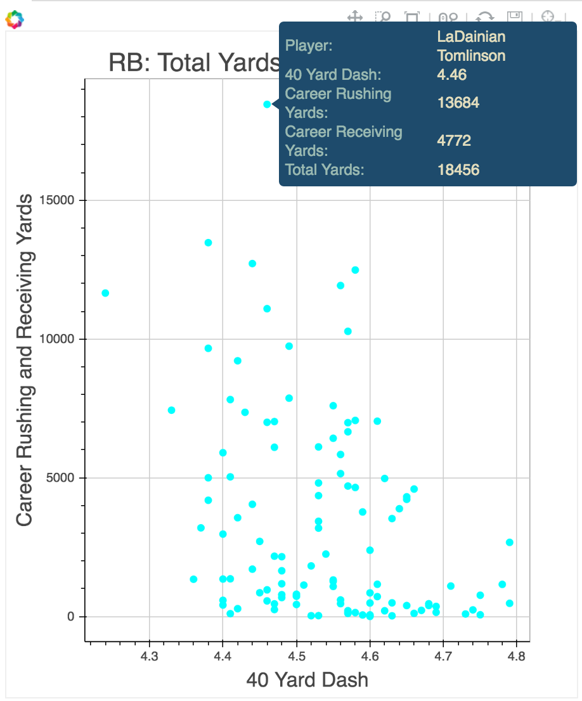

# nflPlayerPerformance
collaborators: Long Chen, Melaku Dubie, Rich Lee and Kivan Polimis

Every year, hundreds of collegiate football players are invited to participate in
a week-long scouting combine. Players are evaluated by NFL personnel departments
on a series of physical and mental tests. Results from these “measurables” influence
positioning in the ensuing NFL draft months after the combine. Our goal with this
project was to determine the association between pre-draft metrics and career performance

## Interactive plotting
Press the  link to open a jupyter notebook directory window.
Select plots.ipynb to start an interactive notebook that plots the relationship between assorted Combine
metrics (40 time, vertical, speed score, etc.) and total yards in a NFL career for quarterbacks, running backs and wide receivers

## Data sources
Passing, rushing and receiving data for individual seasons:  
[Pro-football reference](http://www.pro-football-reference.com/years/2015/passing.htm)  
Scouting combine and player database:  
[NFL savant](http://www.nflsavant.com/about.php)  

## Installation
To install and run:  
Windows and OSX install instructions (Maverick & Yosemite):

Download and install Python 2.7 from [`here`](http://continuum.io/downloads#all)

2. Obtaining the files 
    Go to
3. Starting a Python virtual environment
  
   For OSX:
   ~~~bash
   cd Python_venv
   conda create -n venv python=2.7
   source activate venv
   cd..
   ~~~
  
   For Windows (use command prompt, not Git Bash):
   ~~~bash
   cd Python_venv
   conda create -n venv python=2.7
   activate venv
   cd..
   ~~~
   Now you are in the virtual environment!

5. Installing the required packages
    ~~~bash
    pip install -r Python_venv/requirements.txt
    ~~~

We chose a BSD license to (hopefully) increase the amount of potential users and contributors.
